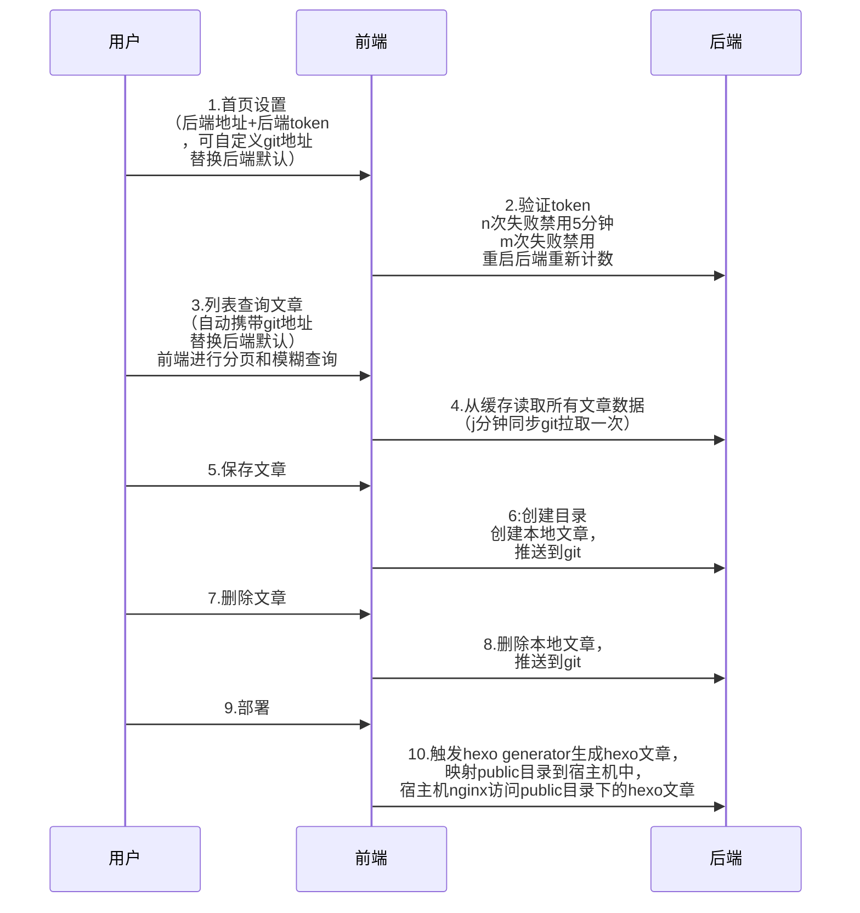

## 1.介绍
一个基于 Vue3 + FastAPI 的无头 CMS，用于通过 Web 界面管理 Hexo 博客的 Markdown 内容，并通过 Git 同步与映射hexo实现自动化发布。

## 2.软件架构
前端 cms-frontend：vue3+vue-router+ts+vite+element-plus+pinia+bytemd

后端 cms-backend：python+fastapi+gitpython

时序图如下：




## 3.功能说明

主要功能
* 1.首页设置后端地址及固定token，修改自己的hexo博客的git地址
* 2.列表查询文章，后端缓存刷新文章数据
* 3.创建文章，后端推送到git
* 4.删除文章，后端推送到git
* 5.部署自己的hexo博客，后端执行hexo的生成命令，映射目录实现部署效果


## 4.安装教程


### 4.1 后端cms-backend部署

#### 4.1.1 前提概要
* 配置token，hexo的git仓库地址和对应的分支

* docker-compose.yml可以参考docker-compose-temp.yml

1.在config.py配置
```angular2html
配置token
SECRET_TOKEN = os.getenv("ACCESS_TOKEN", "自定义token")

"url": os.getenv("HEXO_GIT_REPO", "git@gitee.com:xxx-hexo.git"),# 从环境变量读取,hexo的git地址 

"branch": os.getenv("HEXO_GIT_BRANCH", "master"),# 从环境变量读取,hexo的git 分支 一般为master或者main
```

2.在docker-compose.yml中配置
```angular2html
- ACCESS_TOKEN=your_secret_token_here
- HEXO_GIT_REPO=git@github.com:yourname/your-hexo-repo.git
- HEXO_GIT_BRANCH=master

```

3.ps：

1.docker中docker-compose时设置的环境变量优先于config.py设置的

2.可以使用token_generator.py生成随机的token参数然后再复制过去配置token

#### 4.1.2 dev使用


```
#安装
cd cd .\cms-backend\
pip install -r requirements.txt

#运行
py .\run.py
```


#### 4.1.3 docker运行使用

```
docker-compose up --build -d
```

#### 4.1.4 其他问题（可能遇到的）
1. ssh key权限设置
   linux
```
chmod 600 ./ssh/id_rsa_hexo
```
win
```
# 进入 WSL 
wsl 

# 或打开 Git Bash 
cd /mnt/c/Users/10243/project/headless-cms-hexo/cmsBackend/ssh

chmod 600 ./ssh/id_rsa_hexo
```

2. win中known_hosts问题处理
```
ssh -T git@github.com
ssh -T git@giteee.com
```


### 4.2 前端 cms-frontend


#### 4.2.1 dev使用（node24）


```
#安装
cd cd .\cms-frontend\
npm install

#运行
npm run dev
```


#### 4.2.2 docker运行使用

```
docker-compose up --build -d
```


## 5.使用说明

### 5.1 总体概述
1. 前端可以指定后端地址及固定token，修改hexo的git地址
2. 后端可以本地运行及配置hexo的git地址，固定token，对前端请求做token校验，固定token认证，同ip n次错误临时封禁5分钟，m次错误永久封禁（内存/redis实现）
3. 在服务器本地维护一份 Hexo 源码仓库（含 `_posts` 目录）
4. 使用 gitpython 执行 Git 操作
5. 在通过 Token 验证后，异步拉取最新 Git 代码并执行 `npm install`、`hexo clean`、`hexo generate` 完成 Hexo 博客自动构建，确保每次构建基于最新内容。

### 5.2 设计前端
首页，文章列表页，文章编辑页面，固定菜单栏在页面上方
1. 首页进行git地址，分支自定义读取展示和设置，前端自定义配置后端地址
2. 文章列表页面，展示文章列表，上部分为文章标题搜索框，查询按钮，新增文章按钮，文章列表具有编辑，删除按钮。
3. 文章编辑页面，支持文章读取到bytemd这个富文本编辑器，有保存按钮


## 6.未来可扩展方向

| 功能            | 描述                     |
| ------------- | ---------------------- |
| webhook部署     | 其他远程方式部署               |
| 多站点支持         | 配置多个 Hexo 项目路径         |
| 图片上传          | 集成图床（minio，sso，rustfs） |
| 权限系统          | 多用户、角色管理（Admin/User）   |
| Draft Preview | 生成临时预览链接               |
| RSS/SEO 支持    | 自动生成 sitemap           |
| 插件机制          | 支持自定义字段、模板             |
